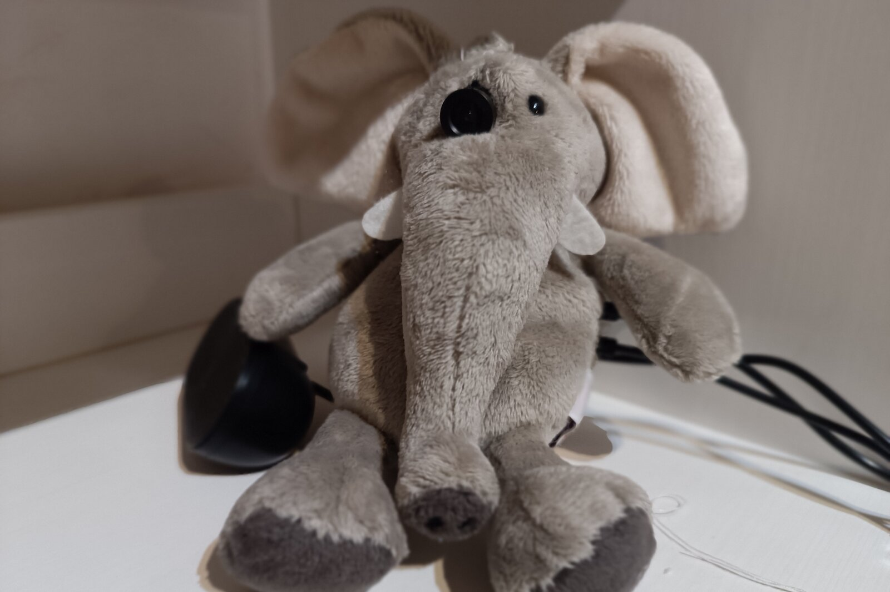

# Philosopher 🐘

**A conversational-AI plush toy that recognizes your face, reads your mood, remembers you, and talks back — with a personality.**

Philosopher is a soft toy with a brain. It listens, sees who is in front of it,
picks up the emotion on their face, and holds a real conversation in a chosen
personality (a stoic philosopher, a curious child, a poet…). It remembers each
person separately across conversations. All of the AI runs on a nearby laptop; the
toy itself is a tiny, ML-free Raspberry Pi that just handles microphone, camera,
speaker and a head servo.

> Speech-to-text, face + emotion recognition, text-to-speech, memory and an
> LLM-driven personality — streamed to the toy over WebSockets in real time, and
> able to run **100% on your own hardware with no internet and no cloud**.

---

## Demo

<!-- Replace VIDEO_ID_ES / VIDEO_ID_EN with the real YouTube IDs once the videos are published. -->

[](https://youtu.be/VIDEO_ID_ES)

▶️ The same question — *what is the meaning of life?* — asked to each personality:
**[🇪🇸 Español](https://youtu.be/VIDEO_ID_ES)** · **[🇬🇧 English](https://youtu.be/VIDEO_ID_EN)**

---

## How it works

Two independent Python projects talk to each other over a WebSocket, plus an
external LLM. The split exists for one reason: the toy's board has only 512 MB of
RAM, so **all** inference lives on a real CPU (a laptop), and the toy stays a dumb,
low-power I/O node.

```
External LLM  ──HTTP──▶  philosopher-server (laptop, the brain)  ◀──WebSocket──▶  philosopher-toy (Pi Zero WH, I/O only)
  any OpenAI-compatible   STT · vision · TTS · LangGraph · memory                  mic · camera · speaker · head servo
  endpoint, ~8B model
```

- **`philosopher-server/`** — the brain. Does everything: speech-to-text
  (faster-whisper), face identity (dlib/`face_recognition`) + emotion (FER+ ONNX),
  text-to-speech (Kokoro / Piper / Edge), a LangGraph conversation pipeline, dual
  memory, personality, and proxying an external LLM. Exposes a WebSocket for the
  toy and HTTP for diagnostics.
- **`philosopher-toy/`** — the body. Runs on a Raspberry Pi Zero WH inside the
  plush toy. Zero ML: captures mic + camera, streams to the server, plays back the
  audio it gets, moves the head servo.
- **External LLM** — any OpenAI-compatible endpoint (Ollama, llama.cpp, vLLM,
  LM Studio, OpenAI). The server only streams tokens from it.

## Features

- 🔒 **Runs 100% local / offline** — pair it with a local LLM (Ollama, llama.cpp,
  vLLM, LM Studio…) and every model runs on your own machines: nothing leaves your
  LAN, no cloud, no data collected.
- 🗣️ **Real-time voice conversation** — streamed sentence-by-sentence, so the toy
  starts speaking before the whole reply is generated.
- 👤 **Knows who it's talking to** — face recognition by encoding distance, robust
  to lighting; several people can share one toy.
- 😊 **Emotion-aware** — reads the face's emotion and reflects it in the reply.
- 🧠 **Remembers you** — short-term and long-term memory, keyed **per person**, so
  one person's conversation never leaks into another's.
- 🎭 **Personalities are just YAML** — `philosopher`, `curious`, `poetic`,
  `friend`, `wise`; add one by dropping a file in. No code.
- 🌍 **Multilingual by a single knob** — `PHILOSOPHER_LANGUAGE=es|en` switches the
  personality, the STT language, and the TTS voice together.
- 🔊 **Pluggable TTS** — local/offline neural (Kokoro, default), Piper, or online
  Microsoft Edge voices.
- 💤 **Optional wake gate** — the toy can stay asleep until an activation phrase.
- 🔌 **Plug-and-go** — `./run.sh install` registers the toy as a **systemd
  service**, so it boots straight into the app and reconnects to the server on its
  own whenever it's powered on — no login or manual start.
- 📊 **Live dashboard** — who's present, per-person emotion histograms, a live
  emotion chart (`GET /dashboard`).

## Quickstart

You need an OpenAI-compatible LLM endpoint running somewhere (e.g. LM Studio or
Ollama with an ~8B model).

**0. Get the code** on **both** machines — one repo holds both projects, so clone
it on the laptop *and* on the Pi:

```bash
git clone https://github.com/msalsas/philosopher.git && cd philosopher
```

Step 1 runs on the laptop, step 2 on the Pi (SSH into it), and step 3 from the
laptop (it reaches the Pi over key-based SSH).

**1. Install the server** (the brain — on the laptop):

```bash
# system packages (not pip): build-essential + cmake build dlib (face recognition); espeak-ng is Kokoro's phonemizer
sudo apt install -y build-essential cmake espeak-ng
# (piper TTS instead of Kokoro? install the `piper` binary separately — see runbook. edge TTS? also `sudo apt install -y ffmpeg`.)

cd philosopher-server
pip install -e ".[tts-kokoro]"            # tts-kokoro = the default (local, offline) voice backend  (add ,dev to also run the tests)
cp .env.example .env                      # point PHILOSOPHER_LLM_BASE_URL at your LLM
python scripts/download_models.py         # pre-fetch the STT/vision/TTS models (optional)
python scripts/check_runtime_deps.py      # readiness gate: dlib, TTS backend, cascade, models (exit≠0 if missing)
```

`check_runtime_deps.py` is the fastest way to find out if a from-scratch install
is complete — it reports exactly which library, binary or model is missing. Full
install details (including ARM64/Raspberry Pi notes) are in the
[hardware runbook](./HARDWARE_RUNBOOK.md).

**2. Install the toy** (the body — on a Raspberry Pi Zero WH):

```bash
# system packages (not pip): its I/O binaries — audio (arecord/aplay) + camera (rpicam-still)
sudo apt install -y alsa-utils rpicam-apps

cd philosopher-toy
pip install -e .                             # add ,dev only to run the tests -> pip install -e ".[dev]"
cp .env.example .env                         # set PHILOSOPHER_SERVER_URL to the server machine's IP
```

The full Pi bring-up — GPIO/servo setup, camera and audio config — is in the
[hardware runbook](./HARDWARE_RUNBOOK.md).

**3. Run it.** `run.sh` is the launcher: it prefetches the models, starts the
server on this machine and the toy on the Pi (over SSH), and can install the toy
as a boot service. Create `run.local.env` first (see `run.local.env.example`) with
your Pi's `PI_HOST`:

```bash
./run.sh start        # start server + toy
./run.sh status       # health of both
./run.sh stop         # stop both
./run.sh install      # autostart the toy on boot (systemd) — then it just comes up when powered on
```

**No hardware or models handy?** Run the pieces directly, stubbed:

```bash
MOCK_MODE=true python -m philosopher.main --server   # server alone, no models
python scripts/fake_toy.py                           # drive it end-to-end, no toy
PHILOSOPHER_MOCK=true python -m toy_client.main      # toy client, no hardware
```

## Hardware

The shipped toy is a **Raspberry Pi Zero WH (512 MB)** with a USB microphone, a
USB speaker, a NoIR OV5647 CSI camera, and a head servo. The head runs on
**hardware PWM**, ramped a step at a time so it pans **smoothly** (no software-PWM
tremor) and then **released at rest** (duty 0, drawing no current) so it never
browns out the 5 V rail alongside the audio amp. The arm servos in the pin map are
disabled on this rig — only the head moves. The full bring-up sequence —
dlib/Piper/model install, camera and audio setup, the servo power gotchas,
autostart — is in [`HARDWARE_RUNBOOK.md`](./HARDWARE_RUNBOOK.md).

## Documentation

- **[`CLAUDE.md`](./CLAUDE.md)** — the canonical, in-depth guide: architecture, the
  two execution paths, the WebSocket protocol, configuration, conventions, and the
  hard-won gotchas. Start here to work on the code.
- **[`HARDWARE_RUNBOOK.md`](./HARDWARE_RUNBOOK.md)** — bringing it up on real
  hardware, step by step, with per-step triage.

## License

Released under the [MIT License](./LICENSE).
